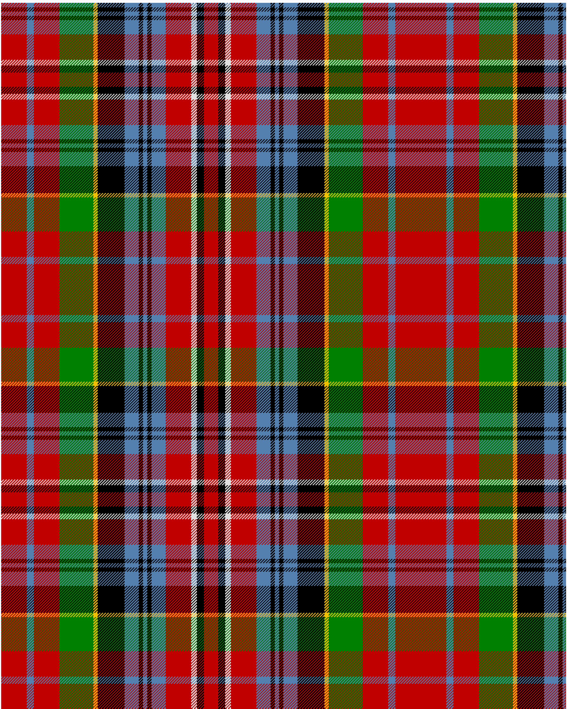

Kidd, Wilson's No 43

This was sourced from <no value>.  It is a 15 stripes tartan.

Original link http://www.weddslist.com/cgi-bin/tartans/pg.pl?source=sts

## Thread count
R/36 B10 R36 G48 Y6 K38 B20 K6 B6 K6 B20 R36 LN8 K10 R/10

## Palette
B#5480B0 G#008000 K#000000 LN#E0E0E0 R#C00000 Y#F0C000

# Sample pattern

ID: /variants/r/36/b10/r36/g48/y6/k38/b20/k6/b6/k6/b20/r36/ln8/k10/r/10-b5480b0-g008000-k000000-lne0e0e0-rc00000-yf0c000