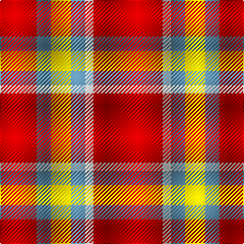

The parent of this is [Ploysongsang, Edward Thiravej (Pers](/tartans/r/36/b14/y20/b14/w8/r/68/)

This was sourced from tartans-authority.  It is a [6 stripes tartan](/stripes/stripes6/).

Original link http://www.tartansauthority.com/tartan-ferret/display/11034/

## Thread count
R/36 B14 Y20 B14 W8 R/68

## Palette
Each colour and its ΔE from the base-6 reference it is a variant of.

| Colour | Shade | Base | ΔE (OKLab) |
|---|---|---|---|
| B |  `#5C8CA8` | B  | 0.23 |
| R |  `#C80000` | R  | 0.00 |
| W |  `#FCFCFC` | W  | 0.03 |
| Y |  `#FCCC00` | Y  | 0.04 |

# Sample pattern

ID: /variants/r/36/b14/y20/b14/w8/r/68-b5c8ca8-rc80000-wfcfcfc-yfccc00/
