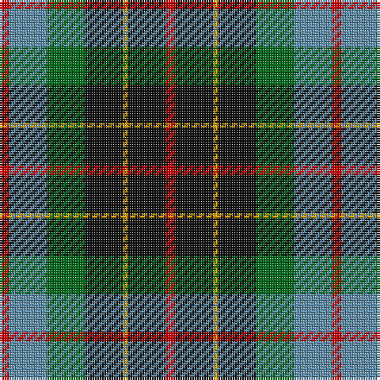

The parent of this is [Brodie Hunting (Clan)](/tartans/r/4/b16/g16/k16/dy2/k16/r/4/)

This was sourced from tartans-authority.  It is a [7 stripes tartan](/stripes/stripes7/).

Original link http://www.tartansauthority.com/tartan-ferret/display/1334/

## Thread count
R/4 B16 G16 K16 DY2 K16 R/4

## Palette
Each colour and its ΔE from the base-6 reference it is a variant of.

| Colour | Shade | Base | ΔE (OKLab) |
|---|---|---|---|
| B |  `#5C8CA8` | B  | 0.23 |
| DY |  `#D09800` | Y  | 0.11 |
| G |  `#006818` | G  | 0.02 |
| K |  `#101010` | K  | 0.17 |
| R |  `#C80000` | R  | 0.00 |

# Sample pattern

ID: /variants/r/4/b16/g16/k16/dy2/k16/r/4-b5c8ca8-dyd09800-g006818-k101010-rc80000/
