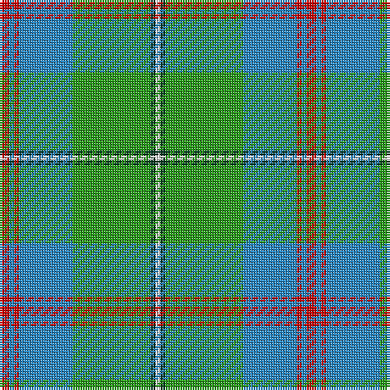

The parent of this is [Gift of Life Michigan (Corporate)](/tartans/r/4/b2/r2/b22/g32/dg2/w/2/)

This was sourced from tartans-authority.  It is a [7 stripes tartan](/stripes/stripes7/).

Original link http://www.tartansauthority.com/tartan-ferret/display/10354/

## Thread count
R/4 B2 R2 B22 G32 DG2 W/2

## Palette
Each colour and its ΔE from the base-6 reference it is a variant of.

| Colour | Shade | Base | ΔE (OKLab) |
|---|---|---|---|
| B |  `#2888C4` | B  | 0.21 |
| DG |  `#003820` | G  | 0.16 |
| G |  `#289C18` | G  | 0.18 |
| R |  `#C80000` | R  | 0.00 |
| W |  `#FCFCFC` | W  | 0.03 |

# Sample pattern

ID: /variants/r/4/b2/r2/b22/g32/dg2/w/2-b2888c4-dg003820-g289c18-rc80000-wfcfcfc/
