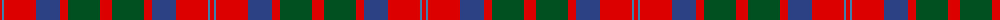
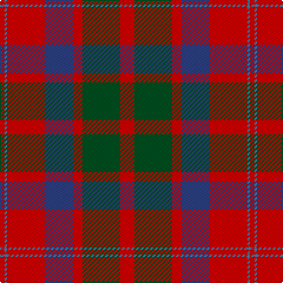

The parent of this is [MacQuarrie #6](/tartans/r/4/b2/r32/ba24/r8/g32/r/12/)

This was sourced from register-of-tartans.  It is a [7 stripes tartan](/stripes/stripes7/).

Original link https://www.tartanregister.gov.uk/tartanDetails.aspx?ref=2733

## Thread count
R/4 B2 R32 Ba24 R8 G32 R/12

## Palette
Each colour and its ΔE from the base-6 reference it is a variant of.

| Colour | Shade | Base | ΔE (OKLab) |
|---|---|---|---|
| B |  `#3C82AF` | B  | 0.20 |
| Ba |  `#2C4084` | B  | 0.00 |
| G |  `#005020` | G  | 0.08 |
| R |  `#DC0000` | R  | 0.04 |

# Sample pattern

ID: /variants/r/4/b2/r32/ba24/r8/g32/r/12-b3c82af-ba2c4084-g005020-rdc0000/
