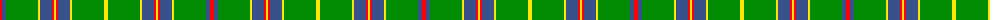

The parent of this is [Monroig, Eric (Personal)](/tartans/r/4/b4/g32/y2/b12/r2/y2/r2/b12/y2/g32/y/4/)

This was sourced from register-of-tartans.  It is a [12 stripes tartan](/stripes/stripes12/).

Original link https://www.tartanregister.gov.uk/tartanDetails.aspx?ref=11583

## Thread count
R/4 B4 G32 Y2 B12 R2 Y2 R2 B12 Y2 G32 Y/4

## Palette
Each colour and its ΔE from the base-6 reference it is a variant of.

| Colour | Shade | Base | ΔE (OKLab) |
|---|---|---|---|
| B |  `#38508C` | B  | 0.05 |
| G |  `#008B00` | G  | 0.12 |
| R |  `#FF0000` | R  | 0.11 |
| Y |  `#FFE600` | Y  | 0.10 |

ID: /variants/r/4/b4/g32/y2/b12/r2/y2/r2/b12/y2/g32/y/4-b38508c-g008b00-rff0000-yffe600/
