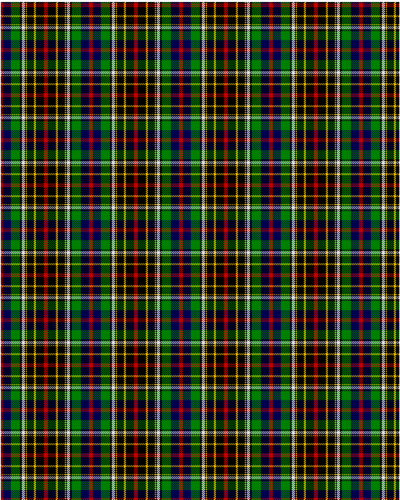

Hislop hunting

This was sourced from <no value>.  It is a 11 stripes tartan.

Original link http://www.weddslist.com/cgi-bin/tartans/pg.pl?source=sts

## Thread count
R/4 DB16 G18 K4 LN6 K2 Y2 K14 Y4 K16 R/4

## Palette
DB#000050 G#008000 K#000000 LN#E0E0E0 R#C00000 Y#F0C000

# Sample pattern

ID: /variants/r/4/db16/g18/k4/ln6/k2/y2/k14/y4/k16/r/4-db000050-g008000-k000000-lne0e0e0-rc00000-yf0c000