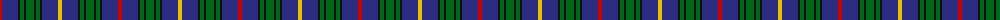

The parent of this is [MacCainsh Family Tartan Tartan Number: 1379. Earliest known date: pre 1992 From the Lumsden Collection ( Alec Lumsden of Toronto). See products available Copyright © Blair Urquhart, Comrie, 2015](/tartans/r/4/db16/k2/g4/k2/g8/k2/g4/k2/db16/y/4/)

This was sourced from house-of-tartan.  It is a [11 stripes tartan](/stripes/stripes11/).

Original link http://www.house-of-tartan.scotland.net/house/TartanViewjs.asp?colr=Def&tnam=1379

## Thread count
R/4 DB16 K2 G4 K2 G8 K2 G4 K2 DB16 Y/4

## Palette
Each colour and its ΔE from the base-6 reference it is a variant of.

| Colour | Shade | Base | ΔE (OKLab) |
|---|---|---|---|
| DB |  `#2C2C80` | B  | 0.05 |
| G |  `#006818` | G  | 0.02 |
| K |  `#101010` | K  | 0.17 |
| R |  `#C80000` | R  | 0.00 |
| Y |  `#E8C000` | Y  | 0.00 |

ID: /variants/r/4/db16/k2/g4/k2/g8/k2/g4/k2/db16/y/4-db2c2c80-g006818-k101010-rc80000-ye8c000/
