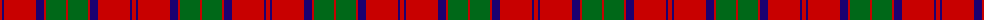
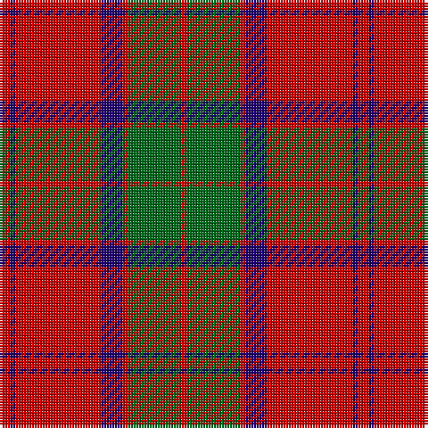

The parent of this is [Robertson - 1988 (Corporate)](/tartans/r/4/db2/r32/db8/r2/g20/r/2/)

This was sourced from tartans-authority.  It is a [7 stripes tartan](/stripes/stripes7/).

Original link http://www.tartansauthority.com/tartan-ferret/display/3159/

## Thread count
R/4 DB2 R32 DB8 R2 G20 R/2

## Palette
Each colour and its ΔE from the base-6 reference it is a variant of.

| Colour | Shade | Base | ΔE (OKLab) |
|---|---|---|---|
| DB |  `#1C0070` | B  | 0.14 |
| G |  `#006818` | G  | 0.02 |
| R |  `#C80000` | R  | 0.00 |

# Sample pattern

ID: /variants/r/4/db2/r32/db8/r2/g20/r/2-db1c0070-g006818-rc80000/
