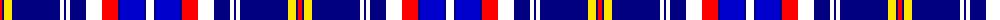

The parent of this is [Submariners Corporate Tartan Tartan Number: 10589. Earliest known date: 23/03/2012 Commissioned by Steven Johnson of Lisburn, NI. The colours are taken from the Royal Navy ensigns with the gold and red of the dolphin symbol worn by submariners. See products available Copyright © Blair Urquhart, Comrie, 2015](/tartans/r/4/db2/y8/db48/w4/db2/w4/db16/w16/r16/db2/b24/db2/w/8/)

This was sourced from house-of-tartan.  It is a [14 stripes tartan](/stripes/stripes14/).

Original link http://www.house-of-tartan.scotland.net/house/TartanViewjs.asp?colr=Def&tnam=10589

## Thread count
R/4 DB2 Y8 DB48 W4 DB2 W4 DB16 W16 R16 DB2 B24 DB2 W/8

## Palette
Each colour and its ΔE from the base-6 reference it is a variant of.

| Colour | Shade | Base | ΔE (OKLab) |
|---|---|---|---|
| B |  `#0000CD` | B  | 0.15 |
| DB |  `#000080` | B  | 0.14 |
| R |  `#FF0000` | R  | 0.11 |
| W |  `#FFFFFF` | W  | 0.03 |
| Y |  `#FFE600` | Y  | 0.10 |

ID: /variants/r/4/db2/y8/db48/w4/db2/w4/db16/w16/r16/db2/b24/db2/w/8-b0000cd-db000080-rff0000-wffffff-yffe600/
