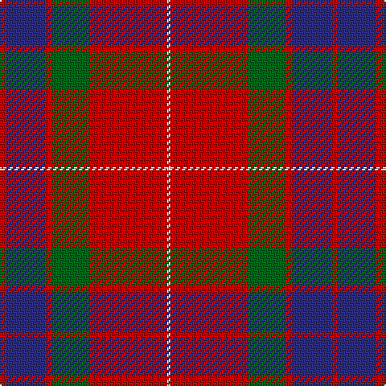

The parent of this is [Fraser - 1842 (Clan)](/tartans/r/4/db24/r4/g24/r48/w/2/)

This was sourced from tartans-authority.  It is a [6 stripes tartan](/stripes/stripes6/).

Original link http://www.tartansauthority.com/tartan-ferret/display/1424/

## Thread count
R/4 DB24 R4 G24 R48 W/2

## Palette
Each colour and its ΔE from the base-6 reference it is a variant of.

| Colour | Shade | Base | ΔE (OKLab) |
|---|---|---|---|
| DB |  `#2C2C80` | B  | 0.05 |
| G |  `#006818` | G  | 0.02 |
| R |  `#C80000` | R  | 0.00 |
| W |  `#FCFCFC` | W  | 0.03 |

# Sample pattern

ID: /variants/r/4/db24/r4/g24/r48/w/2-db2c2c80-g006818-rc80000-wfcfcfc/
