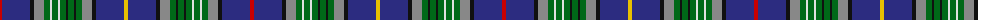

The parent of this is [Service of Drymen Corporate Tartan Tartan Number: 1380. Earliest known date: pre 2003 The design is based on the Sillers connection with the Isle of Arran and the Clan Stewart. See products available Copyright © Blair Urquhart, Comrie, 2015](/tartans/r/4/db28/k4/n10/g6/ln2/g6/ln2/g6/k2/g6/k2/g6/n10/k4/db28/y/4/)

This was sourced from house-of-tartan.  It is a [17 stripes tartan](/stripes/stripes17/).

Original link http://www.house-of-tartan.scotland.net/house/TartanViewjs.asp?colr=Def&tnam=1380

## Thread count
R/4 DB28 K4 N10 G6 LN2 G6 LN2 G6 K2 G6 K2 G6 N10 K4 DB28 Y/4

## Palette
Each colour and its ΔE from the base-6 reference it is a variant of.

| Colour | Shade | Base | ΔE (OKLab) |
|---|---|---|---|
| DB |  `#2C2C80` | B  | 0.05 |
| G |  `#006818` | G  | 0.02 |
| K |  `#101010` | K  | 0.17 |
| LN |  `#E0E0E0` | W  | 0.06 |
| N |  `#888888` | R  | 0.24 |
| R |  `#C80000` | R  | 0.00 |
| Y |  `#E8C000` | Y  | 0.00 |

ID: /variants/r/4/db28/k4/n10/g6/ln2/g6/ln2/g6/k2/g6/k2/g6/n10/k4/db28/y/4-db2c2c80-g006818-k101010-lne0e0e0-n888888-rc80000-ye8c000/
