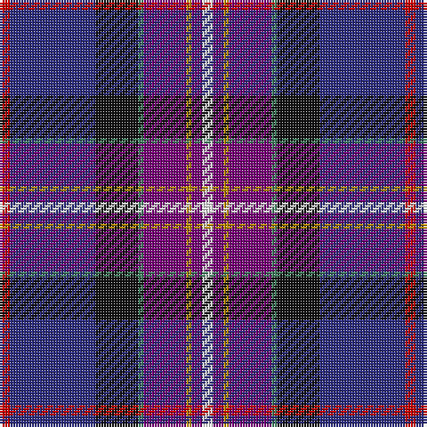

The parent of this is [Freemasons' Universal](/tartans/r/4/db32/k16/g2/p16/dy2/p4/w/4/)

This was sourced from register-of-tartans.  It is a [8 stripes tartan](/stripes/stripes8/).

Original link https://www.tartanregister.gov.uk/tartanDetails.aspx?ref=1279

## Thread count
R/4 DB32 K16 G2 P16 DY2 P4 W/4

## Palette
Each colour and its ΔE from the base-6 reference it is a variant of.

| Colour | Shade | Base | ΔE (OKLab) |
|---|---|---|---|
| B |  `#1474B4` | B  | 0.15 |
| DB |  `#2C2C80` | B  | 0.05 |
| DY |  `#BC8C00` | Y  | 0.16 |
| G |  `#408060` | G  | 0.13 |
| K |  `#101010` | K  | 0.17 |
| P |  `#780078` | B  | 0.16 |
| R |  `#C80000` | R  | 0.00 |
| W |  `#FCFCFC` | W  | 0.03 |

# Sample pattern

ID: /variants/r/4/db32/k16/g2/p16/dy2/p4/w/4-b1474b4-db2c2c80-dybc8c00-g408060-k101010-p780078-rc80000-wfcfcfc/
