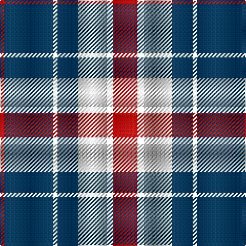

The parent of this is [Yusra Personal Tartan Tartan Number: 10455. Earliest known date: 6th April 2011 The colours used in the design are based on the colours of the Malaysian flag (blue/navy, red, yellow and white/cream) to represent the country of origin of part of the Yusra family. A woven sample of this tartan has been received by the Scottish Register of Tartans for permanent preservation in the National Archives of Scotland. See products available Copyright © Blair Urquhart, Comrie, 2015](/tartans/r/4/db48/yy4/db20/ln28/yy6/r/24/)

This was sourced from house-of-tartan.  It is a [7 stripes tartan](/stripes/stripes7/).

Original link http://www.house-of-tartan.scotland.net/house/TartanViewjs.asp?colr=Def&tnam=10455

## Thread count
R/4 DB48 YY4 DB20 LN28 YY6 R/24

## Palette
Each colour and its ΔE from the base-6 reference it is a variant of.

| Colour | Shade | Base | ΔE (OKLab) |
|---|---|---|---|
| DB |  `#003C64` | B  | 0.07 |
| LN |  `#E0E0E0` | W  | 0.06 |
| O |  `#E86000` | R  | 0.14 |
| Oa |  `#DC943C` | Y  | 0.12 |
| R |  `#C80000` | R  | 0.00 |

# Sample pattern

ID: /variants/r/4/db48/yy4/db20/ln28/yy6/r/24-db003c64-lne0e0e0-oe86000-oadc943c-rc80000/
