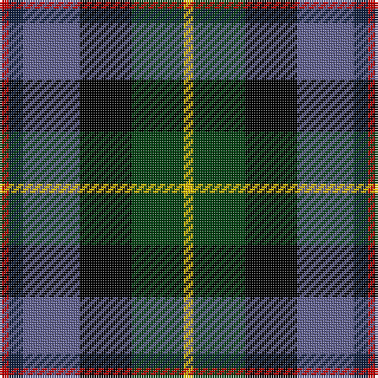

The parent of this is [Huntly Gordon](/tartans/r/4/db6/b24/k22/dg22/y/4/)

This was sourced from weddslist.  It is a [6 stripes tartan](/stripes/stripes6/).

Original link http://www.weddslist.com/cgi-bin/tartans/pg.pl?source=sts

## Thread count
R/4 DB6 B24 K22 DG22 Y/4

## Palette
Each colour and its ΔE from the base-6 reference it is a variant of.

| Colour | Shade | Base | ΔE (OKLab) |
|---|---|---|---|
| B |  `#606090` | B  | 0.12 |
| DB |  `#102040` | B  | 0.15 |
| DG |  `#004010` | G  | 0.12 |
| K |  `#000000` | K  | 0.00 |
| R |  `#C00000` | R  | 0.02 |
| Y |  `#F0C000` | Y  | 0.01 |

# Sample pattern

ID: /variants/r/4/db6/b24/k22/dg22/y/4-b606090-db102040-dg004010-k000000-rc00000-yf0c000/
