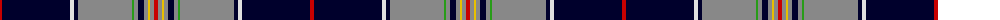

The parent of this is [Hudson's Bay (Corporate)](/tartans/r/4/db68/ln4/db4/n54/g2/n4/db6/n4/y2/n4/r/4/)

This was sourced from tartans-authority.  It is a [12 stripes tartan](/stripes/stripes12/).

Original link http://www.tartansauthority.com/tartan-ferret/display/1612/

## Thread count
R/4 DB68 LN4 DB4 N54 G2 N4 DB6 N4 Y2 N4 R/4

## Palette
Each colour and its ΔE from the base-6 reference it is a variant of.

| Colour | Shade | Base | ΔE (OKLab) |
|---|---|---|---|
| DB |  `#00002C` | K  | 0.16 |
| G |  `#289C18` | G  | 0.18 |
| LN |  `#E0E0E0` | W  | 0.06 |
| N |  `#888888` | R  | 0.24 |
| R |  `#C80000` | R  | 0.00 |
| Y |  `#E8C000` | Y  | 0.00 |

ID: /variants/r/4/db68/ln4/db4/n54/g2/n4/db6/n4/y2/n4/r/4-db00002c-g289c18-lne0e0e0-n888888-rc80000-ye8c000/
