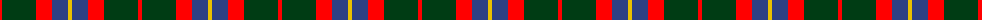
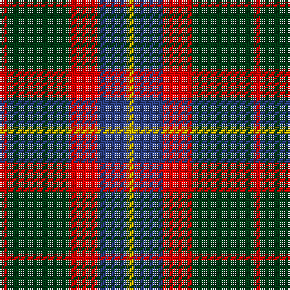

The parent of this is [British Hills](/tartans/r/4/dg34/r16/b16/y/4/)

This was sourced from register-of-tartans.  It is a [5 stripes tartan](/stripes/stripes5/).

Original link https://www.tartanregister.gov.uk/tartanDetails.aspx?ref=11235

## Thread count
R/4 DG34 R16 B16 Y/4

## Palette
Each colour and its ΔE from the base-6 reference it is a variant of.

| Colour | Shade | Base | ΔE (OKLab) |
|---|---|---|---|
| B |  `#2C4084` | B  | 0.00 |
| DG |  `#003C14` | G  | 0.14 |
| R |  `#FF0000` | R  | 0.11 |
| Y |  `#E8C000` | Y  | 0.00 |

# Sample pattern

ID: /variants/r/4/dg34/r16/b16/y/4-b2c4084-dg003c14-rff0000-ye8c000/
