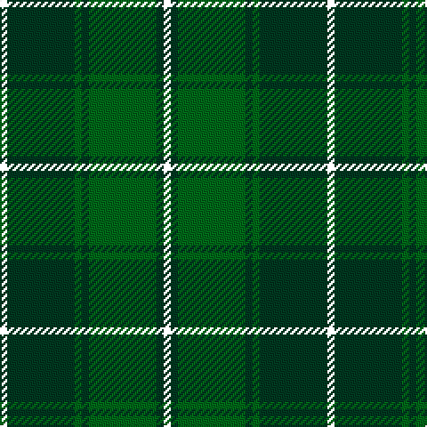

The parent of this is [Hunting Kenmore Trade Com. Tartan Tartan Number: 2234. Earliest known date: 1995 Designed by Polly Wittering of House of Edgar for a range of gifts produced for Macnaughtons of Pitlochry See products available Copyright © Blair Urquhart, Comrie, 2015](/tartans/r/4/dg38/g4/dg4/g38/dg4/y/4/)

This was sourced from house-of-tartan.  It is a [7 stripes tartan](/stripes/stripes7/).

Original link http://www.house-of-tartan.scotland.net/house/TartanViewjs.asp?colr=Def&tnam=2234

## Thread count
R/4 DG38 G4 DG4 G38 DG4 Y/4

## Palette
Each colour and its ΔE from the base-6 reference it is a variant of.

| Colour | Shade | Base | ΔE (OKLab) |
|---|---|---|---|
| DG |  `#003820` | G  | 0.16 |
| DR |  `#880000` | R  | 0.14 |
| DY |  `#D09800` | Y  | 0.11 |
| G |  `#006818` | G  | 0.02 |

# Sample pattern

ID: /variants/r/4/dg38/g4/dg4/g38/dg4/y/4-dg003820-dr880000-dyd09800-g006818/
