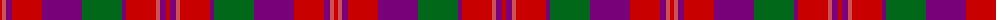

The parent of this is [Drumlithie](/tartans/r/4/do4/p6/r30/p40/g40/p4/r30/do4/p6/r/4/)

This was sourced from register-of-tartans.  It is a [11 stripes tartan](/stripes/stripes11/).

Original link https://www.tartanregister.gov.uk/tartanDetails.aspx?ref=979

## Thread count
R/4 DO4 P6 R30 P40 G40 P4 R30 DO4 P6 R/4

## Palette
Each colour and its ΔE from the base-6 reference it is a variant of.

| Colour | Shade | Base | ΔE (OKLab) |
|---|---|---|---|
| DO |  `#D05054` | R  | 0.10 |
| G |  `#006818` | G  | 0.02 |
| P |  `#780078` | B  | 0.16 |
| R |  `#C80000` | R  | 0.00 |

ID: /variants/r/4/do4/p6/r30/p40/g40/p4/r30/do4/p6/r/4-dod05054-g006818-p780078-rc80000/
