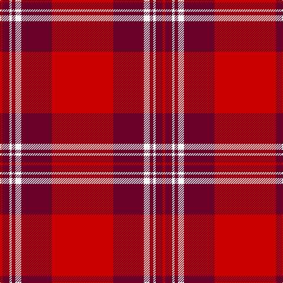

The parent of this is [St. Andrews School (Delaware) (Corp)](/tartans/r/4/dr12/w4/dr6/w10/dr52/r/104/)

This was sourced from tartans-authority.  It is a [7 stripes tartan](/stripes/stripes7/).

Original link http://www.tartansauthority.com/tartan-ferret/display/7744/

## Thread count
R/4 DR12 W4 DR6 W10 DR52 R/104

## Palette
Each colour and its ΔE from the base-6 reference it is a variant of.

| Colour | Shade | Base | ΔE (OKLab) |
|---|---|---|---|
| DR |  `#680028` | B  | 0.20 |
| R |  `#C80000` | R  | 0.00 |
| W |  `#F8F8F8` | W  | 0.01 |

# Sample pattern

ID: /variants/r/4/dr12/w4/dr6/w10/dr52/r/104-dr680028-rc80000-wf8f8f8/
