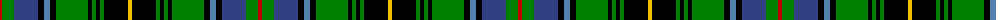

The parent of this is [MacInnes](/tartans/r/4/g12/b24/k6/ba6/k6/g32/k4/g4/k4/g4/k24/y/4/)

This was sourced from weddslist.  It is a [13 stripes tartan](/stripes/stripes13/).

Original link http://www.weddslist.com/cgi-bin/tartans/pg.pl?source=sts

## Thread count
R/4 G12 B24 K6 Ba6 K6 G32 K4 G4 K4 G4 K24 Y/4

## Palette
Each colour and its ΔE from the base-6 reference it is a variant of.

| Colour | Shade | Base | ΔE (OKLab) |
|---|---|---|---|
| B |  `#304080` | B  | 0.01 |
| Ba |  `#5480B0` | B  | 0.20 |
| G |  `#008000` | G  | 0.09 |
| K |  `#000000` | K  | 0.00 |
| R |  `#C00000` | R  | 0.02 |
| Y |  `#F0C000` | Y  | 0.01 |

ID: /variants/r/4/g12/b24/k6/ba6/k6/g32/k4/g4/k4/g4/k24/y/4-b304080-ba5480b0-g008000-k000000-rc00000-yf0c000/
