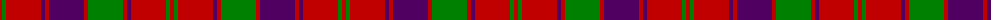

The parent of this is [Robertson 1](/tartans/r/4/g4/r35/dp4/r4/dp35/r4/g35/r4/dp4/r35/g4/r/4/)

This was sourced from weddslist.  It is a [13 stripes tartan](/stripes/stripes13/).

Original link http://www.weddslist.com/cgi-bin/tartans/pg.pl?source=sts

## Thread count
R/4 G4 R35 DP4 R4 DP35 R4 G35 R4 DP4 R35 G4 R/4

## Palette
Each colour and its ΔE from the base-6 reference it is a variant of.

| Colour | Shade | Base | ΔE (OKLab) |
|---|---|---|---|
| DP |  `#500060` | B  | 0.14 |
| G |  `#008000` | G  | 0.09 |
| R |  `#C00000` | R  | 0.02 |

ID: /variants/r/4/g4/r35/dp4/r4/dp35/r4/g35/r4/dp4/r35/g4/r/4-dp500060-g008000-rc00000/
