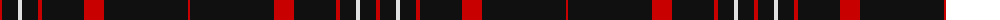

The parent of this is [Brand Ambassador (Corporate)](/tartans/r/4/k16/ln4/k16/r4/k42/r20/k84/r/2/)

This was sourced from tartans-authority.  It is a [9 stripes tartan](/stripes/stripes9/).

Original link http://www.tartansauthority.com/tartan-ferret/display/10462/

## Thread count
R/4 K16 LN4 K16 R4 K42 R20 K84 R/2

## Palette
Each colour and its ΔE from the base-6 reference it is a variant of.

| Colour | Shade | Base | ΔE (OKLab) |
|---|---|---|---|
| K |  `#101010` | K  | 0.17 |
| LN |  `#E0E0E0` | W  | 0.06 |
| R |  `#C80000` | R  | 0.00 |

ID: /variants/r/4/k16/ln4/k16/r4/k42/r20/k84/r/2-k101010-lne0e0e0-rc80000/
