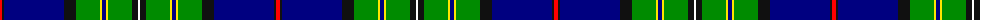

The parent of this is [Hororata District Tartan Tartan Number: 10536. Earliest known date: 9 January 2012 This tartan was created to celebrate the inaugural Hororata Highland Games in the aftermath of the 2011 earthquake which devastated Christchurch and destroyed many important buildings in the small town of Hororata. Based on the Mackenzie Clan tartan after the colourful 19th century New Zealand folk hero, James Mackenzie. Hororata is Maori for 'drooping rata', the Rata tree that produces masses of bright red flowers, leading it to be known as the South Island Christmas tree. Colours: red for the Rata flowers; black and white to complete the colours of the Maori flag; white also represents the snow capped mountains, green represents the fertile Canterbury plains and blue the major rivers flowing into the Pacific; black and yellow are the town colours of Hororata. The design and the first 30 metres of cloth were donated by the Scottish Tartans Authority and Andrew Elliot, weavers of Selkirk. The official registration in the Scottish Register of Tartans was donated by the National Records of Scotland. See products available Copyright © Blair Urquhart, Comrie, 2015](/tartans/r/4/k2/db60/k12/g24/y2/db4/y2/g24/k6/w/2/)

This was sourced from house-of-tartan.  It is a [11 stripes tartan](/stripes/stripes11/).

Original link http://www.house-of-tartan.scotland.net/house/TartanViewjs.asp?colr=Def&tnam=10536

## Thread count
R/4 K2 DB60 K12 G24 Y2 DB4 Y2 G24 K6 W/2

## Palette
Each colour and its ΔE from the base-6 reference it is a variant of.

| Colour | Shade | Base | ΔE (OKLab) |
|---|---|---|---|
| DB |  `#000080` | B  | 0.14 |
| G |  `#008B00` | G  | 0.12 |
| K |  `#101010` | K  | 0.17 |
| R |  `#FF0000` | R  | 0.11 |
| W |  `#FFFFFF` | W  | 0.03 |
| Y |  `#FFE600` | Y  | 0.10 |

ID: /variants/r/4/k2/db60/k12/g24/y2/db4/y2/g24/k6/w/2-db000080-g008b00-k101010-rff0000-wffffff-yffe600/
