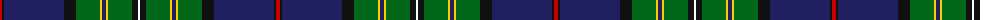

The parent of this is [Hororata (District)](/tartans/r/4/k2/db60/k12/g24/y2/db4/y2/g24/k6/w/2/)

This was sourced from tartans-authority.  It is a [11 stripes tartan](/stripes/stripes11/).

Original link http://www.tartansauthority.com/tartan-ferret/display/10536/

## Thread count
R/4 K2 DB60 K12 G24 Y2 DB4 Y2 G24 K6 W/2

## Palette
Each colour and its ΔE from the base-6 reference it is a variant of.

| Colour | Shade | Base | ΔE (OKLab) |
|---|---|---|---|
| DB |  `#202060` | B  | 0.11 |
| G |  `#006818` | G  | 0.02 |
| K |  `#101010` | K  | 0.17 |
| R |  `#C80000` | R  | 0.00 |
| W |  `#FCFCFC` | W  | 0.03 |
| Y |  `#FCCC00` | Y  | 0.04 |

ID: /variants/r/4/k2/db60/k12/g24/y2/db4/y2/g24/k6/w/2-db202060-g006818-k101010-rc80000-wfcfcfc-yfccc00/
