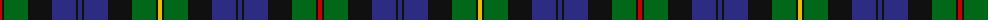

The parent of this is [MacEwen Clan Tartan Tartan Number: 1587. Earliest known date: 1906 The tartan resembles the Campbell of Loudoun except for the red stripe. MacEwans have a historical link with the Campbells dating from 1432 when the lands of MacEwan of the Otter were annexed to Campbell territory. The association was not always a happy one and the 'broken' MacEwans settled in various parts of Lennox, Lochaber and Galloway. See products available Copyright © Blair Urquhart, Comrie, 2015](/tartans/r/4/k2/g24/k24/db24/k2/db4/k2/db24/k24/g24/k2/y/4/)

This was sourced from house-of-tartan.  It is a [13 stripes tartan](/stripes/stripes13/).

Original link http://www.house-of-tartan.scotland.net/house/TartanViewjs.asp?colr=Def&tnam=1587

## Thread count
R/4 K2 G24 K24 DB24 K2 DB4 K2 DB24 K24 G24 K2 Y/4

## Palette
Each colour and its ΔE from the base-6 reference it is a variant of.

| Colour | Shade | Base | ΔE (OKLab) |
|---|---|---|---|
| DB |  `#2C2C80` | B  | 0.05 |
| G |  `#006818` | G  | 0.02 |
| K |  `#101010` | K  | 0.17 |
| R |  `#C80000` | R  | 0.00 |
| Y |  `#E8C000` | Y  | 0.00 |

ID: /variants/r/4/k2/g24/k24/db24/k2/db4/k2/db24/k24/g24/k2/y/4-db2c2c80-g006818-k101010-rc80000-ye8c000/
