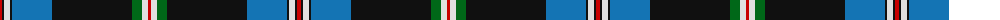

The parent of this is [Italian American Corporate Tartan Tartan Number: 10135. Earliest known date: 5th Jan. 2010 This tartan was designed by Rocky Roeger of USA Kilts and was commissioned by Tony Licalzi, to celebrate the creativity and passion of Italian Americans. The green, white and red represent the colours of the Italian flag and the red, white and blue, the American flag. This is a Universal tartan that is available for anyone to wear. See products available Copyright © Blair Urquhart, Comrie, 2015](/tartans/r/4/k2/ln6/k2/b40/k80/g10/ln6/r/3/)

This was sourced from house-of-tartan.  It is a [9 stripes tartan](/stripes/stripes9/).

Original link http://www.house-of-tartan.scotland.net/house/TartanViewjs.asp?colr=Def&tnam=10135

## Thread count
R/4 K2 LN6 K2 B40 K80 G10 LN6 R/3

## Palette
Each colour and its ΔE from the base-6 reference it is a variant of.

| Colour | Shade | Base | ΔE (OKLab) |
|---|---|---|---|
| B |  `#1474B4` | B  | 0.15 |
| G |  `#006818` | G  | 0.02 |
| K |  `#101010` | K  | 0.17 |
| LN |  `#E0E0E0` | W  | 0.06 |
| R |  `#C80000` | R  | 0.00 |

ID: /variants/r/4/k2/ln6/k2/b40/k80/g10/ln6/r/3-b1474b4-g006818-k101010-lne0e0e0-rc80000/
