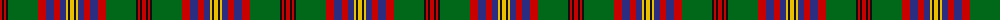

The parent of this is [Celts, Tartan of the (Universal)](/tartans/r/4/k2/r2/k2/g30/r8/db8/r6/db6/y2/k2/y/4/)

This was sourced from tartans-authority.  It is a [12 stripes tartan](/stripes/stripes12/).

Original link http://www.tartansauthority.com/tartan-ferret/display/6706/

## Thread count
R/4 K2 R2 K2 G30 R8 DB8 R6 DB6 Y2 K2 Y/4

## Palette
Each colour and its ΔE from the base-6 reference it is a variant of.

| Colour | Shade | Base | ΔE (OKLab) |
|---|---|---|---|
| DB |  `#2C2C80` | B  | 0.05 |
| G |  `#006818` | G  | 0.02 |
| K |  `#101010` | K  | 0.17 |
| R |  `#C80000` | R  | 0.00 |
| Y |  `#E8C000` | Y  | 0.00 |

ID: /variants/r/4/k2/r2/k2/g30/r8/db8/r6/db6/y2/k2/y/4-db2c2c80-g006818-k101010-rc80000-ye8c000/
