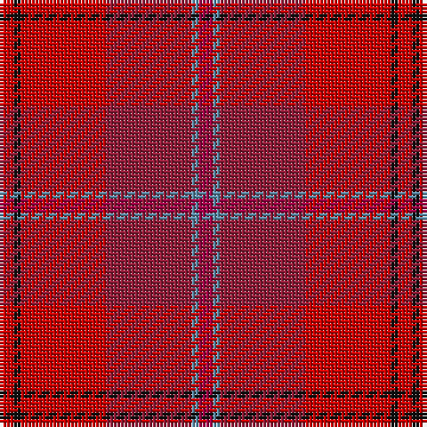

The parent of this is [Grelloch (Fashion)](/tartans/r/4/k2/r24/dr24/b2/ra/4/)

This was sourced from tartans-authority.  It is a [6 stripes tartan](/stripes/stripes6/).

Original link http://www.tartansauthority.com/tartan-ferret/display/4001/

## Thread count
R/4 K2 R24 DR24 B2 Ra/4

## Palette
Each colour and its ΔE from the base-6 reference it is a variant of.

| Colour | Shade | Base | ΔE (OKLab) |
|---|---|---|---|
| B |  `#5C8CA8` | B  | 0.23 |
| DR |  `#901C38` | R  | 0.12 |
| K |  `#101010` | K  | 0.17 |
| R |  `#C80000` | R  | 0.00 |
| Ra |  `#A00048` | R  | 0.11 |

# Sample pattern

ID: /variants/r/4/k2/r24/dr24/b2/ra/4-b5c8ca8-dr901c38-k101010-rc80000-raa00048/
