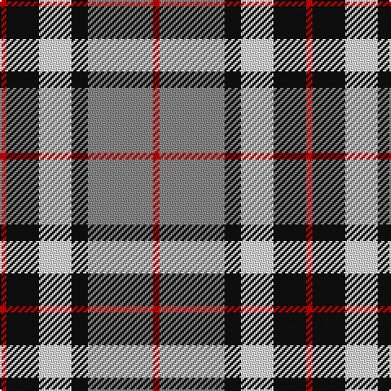

The parent of this is [Thompson Grey Small Tartan Tartan Number: 16111. Earliest known date: pre 2003 Threadcount similar as Thompson Grey 1611. This form applies to "present" the tartans SMALL version. Thompson Grey Small design available in polyvis fabric. See products available Copyright © Blair Urquhart, Comrie, 2015](/tartans/r/4/k20/ln20/k10/n40/r/4/)

This was sourced from house-of-tartan.  It is a [6 stripes tartan](/stripes/stripes6/).

Original link http://www.house-of-tartan.scotland.net/house/TartanViewjs.asp?colr=Def&tnam=16111

## Thread count
R/4 K20 LN20 K10 N40 R/4

## Palette
Each colour and its ΔE from the base-6 reference it is a variant of.

| Colour | Shade | Base | ΔE (OKLab) |
|---|---|---|---|
| K |  `#101010` | K  | 0.17 |
| LN |  `#E0E0E0` | W  | 0.06 |
| N |  `#888888` | R  | 0.24 |
| R |  `#C80000` | R  | 0.00 |

# Sample pattern

ID: /variants/r/4/k20/ln20/k10/n40/r/4-k101010-lne0e0e0-n888888-rc80000/
