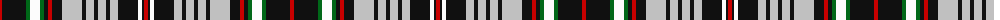

The parent of this is [Southwick (Name)](/tartans/r/4/k24/g4/w10/g4/k4/r4/k10/n20/k4/n8/k4/n8/k4/n8/k20/w4/k2/r/4/)

This was sourced from tartans-authority.  It is a [19 stripes tartan](/stripes/stripes19/).

Original link http://www.tartansauthority.com/tartan-ferret/display/2642/

## Thread count
R/4 K24 G4 W10 G4 K4 R4 K10 N20 K4 N8 K4 N8 K4 N8 K20 W4 K2 R/4

## Palette
Each colour and its ΔE from the base-6 reference it is a variant of.

| Colour | Shade | Base | ΔE (OKLab) |
|---|---|---|---|
| G |  `#006818` | G  | 0.02 |
| K |  `#101010` | K  | 0.17 |
| N |  `#C0C0C0` | W  | 0.16 |
| R |  `#C80000` | R  | 0.00 |
| W |  `#FCFCFC` | W  | 0.03 |

ID: /variants/r/4/k24/g4/w10/g4/k4/r4/k10/n20/k4/n8/k4/n8/k4/n8/k20/w4/k2/r/4-g006818-k101010-nc0c0c0-rc80000-wfcfcfc/
