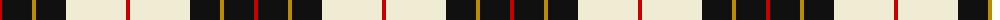
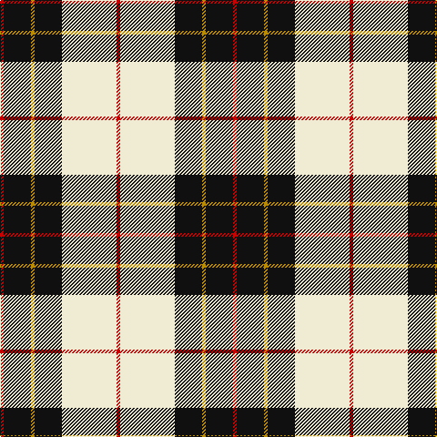

The parent of this is [Brodie (WCWM)](/tartans/r/4/k30/dy4/k30/ly60/r/4/)

This was sourced from register-of-tartans.  It is a [6 stripes tartan](/stripes/stripes6/).

Original link https://www.tartanregister.gov.uk/tartanDetails.aspx?ref=5292

## Thread count
R/4 K30 DY4 K30 LY60 R/4

## Palette
Each colour and its ΔE from the base-6 reference it is a variant of.

| Colour | Shade | Base | ΔE (OKLab) |
|---|---|---|---|
| DY |  `#BC8C00` | Y  | 0.16 |
| K |  `#101010` | K  | 0.17 |
| LY |  `#F0ECD4` | W  | 0.04 |
| R |  `#C80000` | R  | 0.00 |

# Sample pattern

ID: /variants/r/4/k30/dy4/k30/ly60/r/4-dybc8c00-k101010-lyf0ecd4-rc80000/
