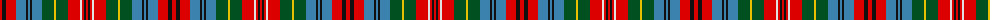

The parent of this is [Unidentified No 3](/tartans/r/4/k4/r10/b10/k2/b2/k2/b10/g12/y2/g12/r12/ln2/r2/k2/r/2/)

This was sourced from register-of-tartans.  It is a [16 stripes tartan](/stripes/stripes16/).

Original link https://www.tartanregister.gov.uk/tartanDetails.aspx?ref=4320

## Thread count
R/4 K4 R10 B10 K2 B2 K2 B10 G12 Y2 G12 R12 LN2 R2 K2 R/2

## Palette
Each colour and its ΔE from the base-6 reference it is a variant of.

| Colour | Shade | Base | ΔE (OKLab) |
|---|---|---|---|
| B |  `#3C82AF` | B  | 0.20 |
| G |  `#005020` | G  | 0.08 |
| K |  `#101010` | K  | 0.17 |
| LN |  `#E0E0E0` | W  | 0.06 |
| R |  `#DC0000` | R  | 0.04 |
| Y |  `#E8C000` | Y  | 0.00 |

ID: /variants/r/4/k4/r10/b10/k2/b2/k2/b10/g12/y2/g12/r12/ln2/r2/k2/r/2-b3c82af-g005020-k101010-lne0e0e0-rdc0000-ye8c000/
