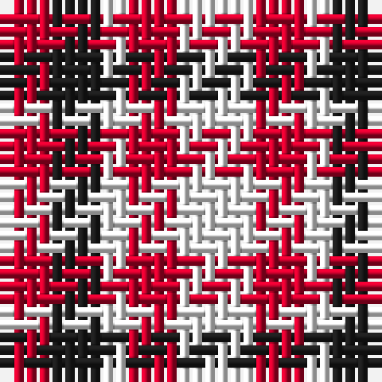

The parent of this is [Oakland Centre](/tartans/r/4/k4/w2/r4/w/6/)

This was sourced from register-of-tartans.  It is a [5 stripes tartan](/stripes/stripes5/).

Original link https://www.tartanregister.gov.uk/tartanDetails.aspx?ref=11587

## Thread count
R/4 K4 W2 R4 W/6

## Palette
Each colour and its ΔE from the base-6 reference it is a variant of.

| Colour | Shade | Base | ΔE (OKLab) |
|---|---|---|---|
| K |  `#1C1C1C` | B  | 0.20 |
| R |  `#C8002C` | R  | 0.03 |
| W |  `#FCFCFC` | W  | 0.03 |

# Sample pattern

ID: /variants/r/4/k4/w2/r4/w/6-k1c1c1c-rc8002c-wfcfcfc/
