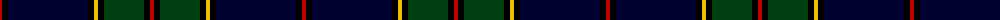

The parent of this is [Strachan](/tartans/r/4/k6/db80/k6/y4/k6/dg40/k6/r/4/)

This was sourced from weddslist.  It is a [9 stripes tartan](/stripes/stripes9/).

Original link http://www.weddslist.com/cgi-bin/tartans/pg.pl?source=sts

## Thread count
R/4 K6 DB80 K6 Y4 K6 DG40 K6 R/4

## Palette
Each colour and its ΔE from the base-6 reference it is a variant of.

| Colour | Shade | Base | ΔE (OKLab) |
|---|---|---|---|
| DB |  `#000030` | K  | 0.17 |
| DG |  `#004010` | G  | 0.12 |
| K |  `#000000` | K  | 0.00 |
| R |  `#C00000` | R  | 0.02 |
| Y |  `#F0C000` | Y  | 0.01 |

ID: /variants/r/4/k6/db80/k6/y4/k6/dg40/k6/r/4-db000030-dg004010-k000000-rc00000-yf0c000/
