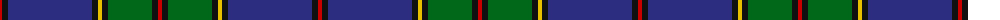

The parent of this is [Strachan Family Tartan Tartan Number: 2601. Earliest known date: 1987 Designed 1987 by A.G.Murray. Was origonally a Personal tartan but now can be regarded as for all of the name 'Strachan'. Woven by D C Dalgliesh. See products available Copyright © Blair Urquhart, Comrie, 2015](/tartans/r/4/k6/dba84/k6/y4/k6/g44/k6/r/4/)

This was sourced from house-of-tartan.  It is a [9 stripes tartan](/stripes/stripes9/).

Original link http://www.house-of-tartan.scotland.net/house/TartanViewjs.asp?colr=Def&tnam=2601

## Thread count
R/4 K6 DBa84 K6 Y4 K6 G44 K6 R/4

## Palette
Each colour and its ΔE from the base-6 reference it is a variant of.

| Colour | Shade | Base | ΔE (OKLab) |
|---|---|---|---|
| DB |  `#1C0070` | B  | 0.14 |
| DBa |  `#2C2C80` | B  | 0.05 |
| DR |  `#880000` | R  | 0.14 |
| DY |  `#D09800` | Y  | 0.11 |
| G |  `#006818` | G  | 0.02 |
| K |  `#101010` | K  | 0.17 |
| R |  `#C80000` | R  | 0.00 |
| Y |  `#E8C000` | Y  | 0.00 |

ID: /variants/r/4/k6/dba84/k6/y4/k6/g44/k6/r/4-db1c0070-dba2c2c80-dr880000-dyd09800-g006818-k101010-rc80000-ye8c000/
