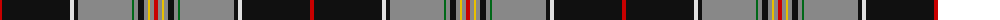

The parent of this is [Hudson Bay Company Corporate Tartan Tartan Number: 1612. Earliest known date: 1984 Designed by Gordon Kirkbright now (2002) of Fraser & Kirkbright, Vancouver, when he worked with West Coast Woolen Mill. Orange sometimes given as Red. Often woven in reprocolours where black becomes a dark brown. See products available Copyright © Blair Urquhart, Comrie, 2015](/tartans/r/4/k68/ln4/k4/n54/g2/n4/k6/n4/y2/n4/r/4/)

This was sourced from house-of-tartan.  It is a [12 stripes tartan](/stripes/stripes12/).

Original link http://www.house-of-tartan.scotland.net/house/TartanViewjs.asp?colr=Def&tnam=1612

## Thread count
R/4 K68 LN4 K4 N54 G2 N4 K6 N4 Y2 N4 R/4

## Palette
Each colour and its ΔE from the base-6 reference it is a variant of.

| Colour | Shade | Base | ΔE (OKLab) |
|---|---|---|---|
| G |  `#006818` | G  | 0.02 |
| K |  `#101010` | K  | 0.17 |
| LN |  `#E0E0E0` | W  | 0.06 |
| N |  `#888888` | R  | 0.24 |
| R |  `#C80000` | R  | 0.00 |
| Y |  `#E8C000` | Y  | 0.00 |

ID: /variants/r/4/k68/ln4/k4/n54/g2/n4/k6/n4/y2/n4/r/4-g006818-k101010-lne0e0e0-n888888-rc80000-ye8c000/
