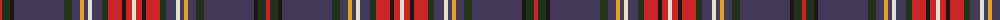

The parent of this is [Hueg (Bavaria) Scottish Blue Thi Name Tartan Tartan Number: 10743. Earliest known date: 27/11/2012 Created by the designer to celebrate his love of Scotland and his belief that there are many similarities between Scots and Bavarians. See products available Copyright © Blair Urquhart, Comrie, 2015](/tartans/r/4/ka8/k4/n50/ka8/n8/y4/n4/w4/n10/ka6/r14/k4/r6/w/4/)

This was sourced from house-of-tartan.  It is a [15 stripes tartan](/stripes/stripes15/).

Original link http://www.house-of-tartan.scotland.net/house/TartanViewjs.asp?colr=Def&tnam=10743

## Thread count
R/4 Ka8 K4 N50 Ka8 N8 Y4 N4 W4 N10 Ka6 R14 K4 R6 W/4

## Palette
Each colour and its ΔE from the base-6 reference it is a variant of.

| Colour | Shade | Base | ΔE (OKLab) |
|---|---|---|---|
| K |  `#1C1714` | K  | 0.21 |
| Ka |  `#23321B` | G  | 0.17 |
| N |  `#433A5A` | B  | 0.08 |
| R |  `#CA2625` | R  | 0.03 |
| W |  `#E5E0D2` | W  | 0.06 |
| Y |  `#E0A126` | Y  | 0.08 |

ID: /variants/r/4/ka8/k4/n50/ka8/n8/y4/n4/w4/n10/ka6/r14/k4/r6/w/4-k1c1714-ka23321b-n433a5a-rca2625-we5e0d2-ye0a126/
