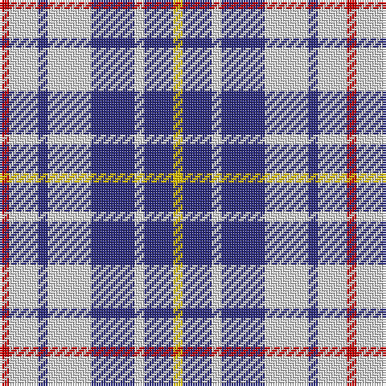

The parent of this is [North Vancouver Island District Tartan Tartan Number: 1682. Earliest known date: 1985 Originally designed for the North Island Highlanders Pipe & Drum Band by Robert Fells of Port Hardy, B.C. See products available Copyright © Blair Urquhart, Comrie, 2015](/tartans/r/4/ln12/db4/ln18/db18/ln4/db12/y/4/)

This was sourced from house-of-tartan.  It is a [8 stripes tartan](/stripes/stripes8/).

Original link http://www.house-of-tartan.scotland.net/house/TartanViewjs.asp?colr=Def&tnam=1682

## Thread count
R/4 LN12 DB4 LN18 DB18 LN4 DB12 Y/4

## Palette
Each colour and its ΔE from the base-6 reference it is a variant of.

| Colour | Shade | Base | ΔE (OKLab) |
|---|---|---|---|
| DB |  `#2C2C80` | B  | 0.05 |
| LN |  `#E0E0E0` | W  | 0.06 |
| R |  `#C80000` | R  | 0.00 |
| Y |  `#E8C000` | Y  | 0.00 |

# Sample pattern

ID: /variants/r/4/ln12/db4/ln18/db18/ln4/db12/y/4-db2c2c80-lne0e0e0-rc80000-ye8c000/
