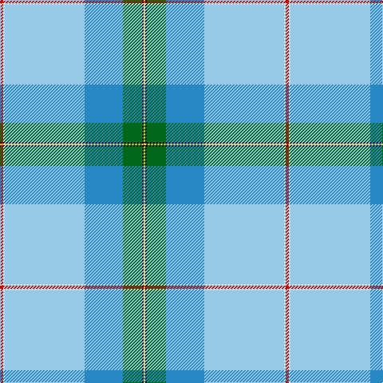

The parent of this is [Pincock (Name)](/tartans/r/4/ln2/lb100/b48/g24/k2/y/2/)

This was sourced from tartans-authority.  It is a [7 stripes tartan](/stripes/stripes7/).

Original link http://www.tartansauthority.com/tartan-ferret/display/10323/

## Thread count
R/4 LN2 LB100 B48 G24 K2 Y/2

## Palette
Each colour and its ΔE from the base-6 reference it is a variant of.

| Colour | Shade | Base | ΔE (OKLab) |
|---|---|---|---|
| B |  `#2888C4` | B  | 0.21 |
| G |  `#006818` | G  | 0.02 |
| K |  `#101010` | K  | 0.17 |
| LB |  `#98C8E8` | W  | 0.17 |
| LN |  `#E0E0E0` | W  | 0.06 |
| R |  `#C80000` | R  | 0.00 |
| Y |  `#FCCC3C` | Y  | 0.05 |

# Sample pattern

ID: /variants/r/4/ln2/lb100/b48/g24/k2/y/2-b2888c4-g006818-k101010-lb98c8e8-lne0e0e0-rc80000-yfccc3c/
