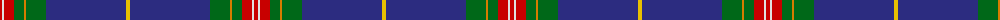

The parent of this is [St. Andrew Quebec City (Corporate)](/tartans/r/4/ln2/r10/g10/o2/g20/db80/y/4/)

This was sourced from tartans-authority.  It is a [8 stripes tartan](/stripes/stripes8/).

Original link http://www.tartansauthority.com/tartan-ferret/display/5814/

## Thread count
R/4 LN2 R10 G10 O2 G20 DB80 Y/4

## Palette
Each colour and its ΔE from the base-6 reference it is a variant of.

| Colour | Shade | Base | ΔE (OKLab) |
|---|---|---|---|
| DB |  `#2C2C80` | B  | 0.05 |
| G |  `#006818` | G  | 0.02 |
| LN |  `#E0E0E0` | W  | 0.06 |
| O |  `#D87C00` | Y  | 0.17 |
| R |  `#C80000` | R  | 0.00 |
| Y |  `#E8C000` | Y  | 0.00 |

# Sample pattern

ID: /variants/r/4/ln2/r10/g10/o2/g20/db80/y/4-db2c2c80-g006818-lne0e0e0-od87c00-rc80000-ye8c000/
