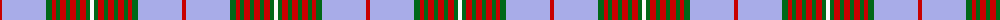

The parent of this is [Princess Marina #2](/tartans/r/4/lp44/g6/r4/g4/r6/g4/r6/g4/r6/g4/w/4/)

This was sourced from register-of-tartans.  It is a [12 stripes tartan](/stripes/stripes12/).

Original link https://www.tartanregister.gov.uk/tartanDetails.aspx?ref=3407

## Thread count
R/4 LP44 G6 R4 G4 R6 G4 R6 G4 R6 G4 W/4

## Palette
Each colour and its ΔE from the base-6 reference it is a variant of.

| Colour | Shade | Base | ΔE (OKLab) |
|---|---|---|---|
| G |  `#006818` | G  | 0.02 |
| LP |  `#A8ACE8` | W  | 0.22 |
| R |  `#C80000` | R  | 0.00 |
| W |  `#FCFCFC` | W  | 0.03 |

ID: /variants/r/4/lp44/g6/r4/g4/r6/g4/r6/g4/r6/g4/w/4-g006818-lpa8ace8-rc80000-wfcfcfc/
