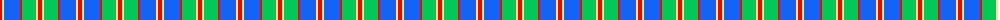
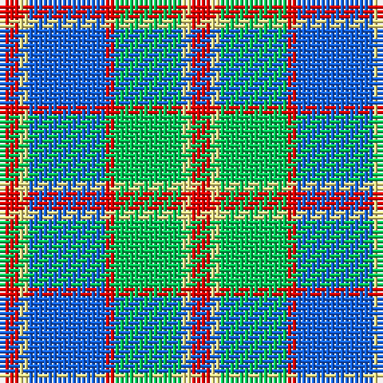

The parent of this is [Cercle de Fermières de Saint-Élie d'Orford](/tartans/r/4/ly2/b16/r2/ba14/ly2/r/4/)

This was sourced from register-of-tartans.  It is a [7 stripes tartan](/stripes/stripes7/).

Original link https://www.tartanregister.gov.uk/tartanDetails.aspx?ref=10392

## Thread count
R/4 LY2 B16 R2 Ba14 LY2 R/4

## Palette
Each colour and its ΔE from the base-6 reference it is a variant of.

| Colour | Shade | Base | ΔE (OKLab) |
|---|---|---|---|
| B |  `#1464F4` | B  | 0.19 |
| Ba |  `#00C957` | Y  | 0.20 |
| LY |  `#FFEC8B` | W  | 0.12 |
| R |  `#FF0000` | R  | 0.11 |

# Sample pattern

ID: /variants/r/4/ly2/b16/r2/ba14/ly2/r/4-b1464f4-ba00c957-lyffec8b-rff0000/
