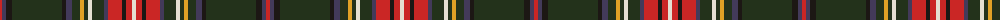

The parent of this is [Hueg (Bavaria) Scottish Thistle (Personal)](/tartans/r/4/n4/k6/ka50/k4/n6/ka8/y4/ka4/w4/ka12/n4/r14/k4/r6/w/4/)

This was sourced from register-of-tartans.  It is a [16 stripes tartan](/stripes/stripes16/).

Original link https://www.tartanregister.gov.uk/tartanDetails.aspx?ref=10736

## Thread count
R/4 N4 K6 Ka50 K4 N6 Ka8 Y4 Ka4 W4 Ka12 N4 R14 K4 R6 W/4

## Palette
Each colour and its ΔE from the base-6 reference it is a variant of.

| Colour | Shade | Base | ΔE (OKLab) |
|---|---|---|---|
| K |  `#1C1714` | K  | 0.21 |
| Ka |  `#23321B` | G  | 0.17 |
| N |  `#433A5A` | B  | 0.08 |
| R |  `#CA2625` | R  | 0.03 |
| W |  `#E5E0D2` | W  | 0.06 |
| Y |  `#E0A126` | Y  | 0.08 |

ID: /variants/r/4/n4/k6/ka50/k4/n6/ka8/y4/ka4/w4/ka12/n4/r14/k4/r6/w/4-k1c1714-ka23321b-n433a5a-rca2625-we5e0d2-ye0a126/
