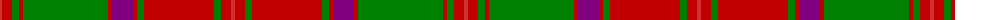

The parent of this is [Crieff](/tartans/r/4/ra10/g7/ra4/g85/ra4/p21/ra4/g7/ra70/g7/ra10/r/4/)

This was sourced from weddslist.  It is a [13 stripes tartan](/stripes/stripes13/).

Original link http://www.weddslist.com/cgi-bin/tartans/pg.pl?source=sts

## Thread count
R/4 Ra10 G7 Ra4 G85 Ra4 P21 Ra4 G7 Ra70 G7 Ra10 R/4

## Palette
Each colour and its ΔE from the base-6 reference it is a variant of.

| Colour | Shade | Base | ΔE (OKLab) |
|---|---|---|---|
| G |  `#008000` | G  | 0.09 |
| P |  `#800080` | B  | 0.17 |
| R |  `#D03030` | R  | 0.05 |
| Ra |  `#C00000` | R  | 0.02 |

ID: /variants/r/4/ra10/g7/ra4/g85/ra4/p21/ra4/g7/ra70/g7/ra10/r/4-g008000-p800080-rd03030-rac00000/
