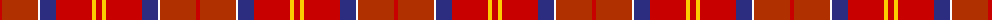

The parent of this is [Barbour - Cardinal Red](/tartans/r/4/ra36/w2/db16/r36/y4/r/6/)

This was sourced from tartans-authority.  It is a [7 stripes tartan](/stripes/stripes7/).

Original link http://www.tartansauthority.com/tartan-ferret/display/8732/

## Thread count
R/4 Ra36 W2 DB16 R36 Y4 R/6

## Palette
Each colour and its ΔE from the base-6 reference it is a variant of.

| Colour | Shade | Base | ΔE (OKLab) |
|---|---|---|---|
| DB |  `#2C2C80` | B  | 0.05 |
| R |  `#C80000` | R  | 0.00 |
| Ra |  `#B03000` | R  | 0.05 |
| W |  `#FCFCFC` | W  | 0.03 |
| Y |  `#FCCC00` | Y  | 0.04 |

# Sample pattern

ID: /variants/r/4/ra36/w2/db16/r36/y4/r/6-db2c2c80-rc80000-rab03000-wfcfcfc-yfccc00/
