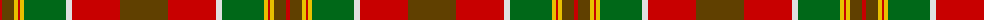

The parent of this is [Henry W.A. Canadian Tartan Tartan Number: 1667. Earliest known date: 1983 See products available Copyright © Blair Urquhart, Comrie, 2015](/tartans/r/4/t12/y4/r2/y4/g42/ln6/r48/t/48/)

This was sourced from house-of-tartan.  It is a [9 stripes tartan](/stripes/stripes9/).

Original link http://www.house-of-tartan.scotland.net/house/TartanViewjs.asp?colr=Def&tnam=1667

## Thread count
R/4 T12 Y4 R2 Y4 G42 LN6 R48 T/48

## Palette
Each colour and its ΔE from the base-6 reference it is a variant of.

| Colour | Shade | Base | ΔE (OKLab) |
|---|---|---|---|
| G |  `#006818` | G  | 0.02 |
| LN |  `#E0E0E0` | W  | 0.06 |
| R |  `#C80000` | R  | 0.00 |
| T |  `#604000` | G  | 0.14 |
| Y |  `#E8C000` | Y  | 0.00 |

ID: /variants/r/4/t12/y4/r2/y4/g42/ln6/r48/t/48-g006818-lne0e0e0-rc80000-t604000-ye8c000/
