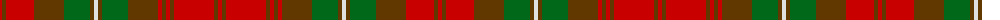

The parent of this is [Mauthe Unidentified](/tartans/r/4/t4/r28/t30/g26/t4/ln4/t4/g26/t30/r4/t4/r4/t4/r40/t4/r/4/)

This was sourced from register-of-tartans.  It is a [17 stripes tartan](/stripes/stripes17/).

Original link https://www.tartanregister.gov.uk/tartanDetails.aspx?ref=2860

## Thread count
R/4 T4 R28 T30 G26 T4 LN4 T4 G26 T30 R4 T4 R4 T4 R40 T4 R/4

## Palette
Each colour and its ΔE from the base-6 reference it is a variant of.

| Colour | Shade | Base | ΔE (OKLab) |
|---|---|---|---|
| G |  `#006818` | G  | 0.02 |
| LN |  `#E0E0E0` | W  | 0.06 |
| R |  `#C80000` | R  | 0.00 |
| T |  `#603800` | G  | 0.16 |

ID: /variants/r/4/t4/r28/t30/g26/t4/ln4/t4/g26/t30/r4/t4/r4/t4/r40/t4/r/4-g006818-lne0e0e0-rc80000-t603800/
