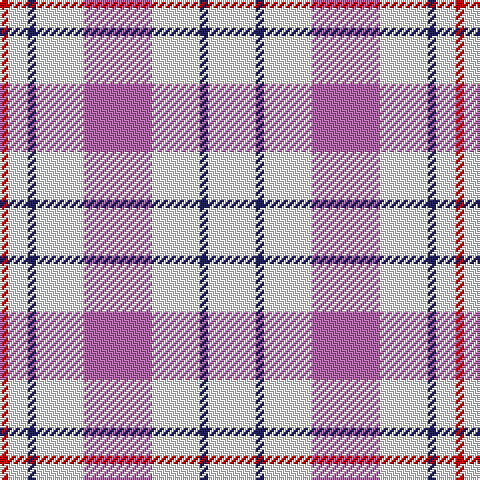

The parent of this is [Milne Purple Dress (Dance)](/tartans/r/4/w10/db4/w24/p34/w24/db4/w/24/)

This was sourced from register-of-tartans.  It is a [8 stripes tartan](/stripes/stripes8/).

Original link https://www.tartanregister.gov.uk/tartanDetails.aspx?ref=2956

## Thread count
R/4 W10 DB4 W24 P34 W24 DB4 W/24

## Palette
Each colour and its ΔE from the base-6 reference it is a variant of.

| Colour | Shade | Base | ΔE (OKLab) |
|---|---|---|---|
| DB |  `#202060` | B  | 0.11 |
| P |  `#B468AC` | R  | 0.21 |
| R |  `#C80000` | R  | 0.00 |
| W |  `#FCFCFC` | W  | 0.03 |

# Sample pattern

ID: /variants/r/4/w10/db4/w24/p34/w24/db4/w/24-db202060-pb468ac-rc80000-wfcfcfc/
