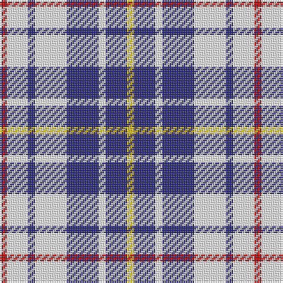

The parent of this is [North Vancouver Island](/tartans/r/4/w12/db4/w18/db18/w4/db12/y/4/)

This was sourced from register-of-tartans.  It is a [8 stripes tartan](/stripes/stripes8/).

Original link https://www.tartanregister.gov.uk/tartanDetails.aspx?ref=3156

## Thread count
R/4 W12 DB4 W18 DB18 W4 DB12 Y/4

## Palette
Each colour and its ΔE from the base-6 reference it is a variant of.

| Colour | Shade | Base | ΔE (OKLab) |
|---|---|---|---|
| DB |  `#2C2C80` | B  | 0.05 |
| R |  `#C80000` | R  | 0.00 |
| W |  `#FFFFFF` | W  | 0.03 |
| Y |  `#E8C000` | Y  | 0.00 |

# Sample pattern

ID: /variants/r/4/w12/db4/w18/db18/w4/db12/y/4-db2c2c80-rc80000-wffffff-ye8c000/
